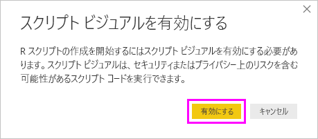

# <a name="create-power-bi-visuals-using-r"></a>R を使用した Power BI ビジュアルの作成
Power BI Desktop では、*R* を使用してデータを視覚化できます。 [R](https://mran.revolutionanalytics.com/documents/what-is-r) は、統計コンピューティングおよびグラフィックス用の言語であり環境です。

## <a name="install-r"></a>R をインストールする
既定では、Power BI Desktop には、R エンジンは含まれておらず、展開、インストールも行われません。 Power BI Desktop で R スクリプトを実行するには、ご利用のローカル コンピューター上に R を別個にインストールする必要があります。 R はさまざまな場所から無料でダウンロードし、インストールできます。たとえば、[Revolution Open ダウンロード ページ](https://mran.revolutionanalytics.com/download/)や [CRAN Repository](https://cran.r-project.org/bin/windows/base/) があります。 Power BI Desktop での R スクリプトの現在のリリースでは、インストール パスで Unicode 文字と空白 (空の文字) がサポートされています。

## <a name="enable-r-visuals-in-power-bi-desktop"></a>Power BI Desktop で R ビジュアルを有効にする
R をインストールすると、Power BI Desktop によって自動的に有効にされます。 Power BI Desktop によって R が正しい場所で有効にされていることを確認するには、次の手順を行います。 

1. Power BI Desktop メニューで、 **[ファイル]**  >  **[オプションと設定]**  >  **[オプション]** の順に選択します。 

2. **[オプション]** ページの左側にある **[グローバル]** で、 **[R スクリプト]** を選択します。 

3. **[R スクリプトのオプション]** で、ご利用のローカル R インストールが **[検出された R ホーム ディレクトリ]** に指定されていること、および Power BI Desktop で使用するローカル R インストールが正しく反映されていることを確認します。 次のイメージで、R のローカル インストールへのパスは **C:\Program Files\R Open\R-3.5.3\\** です。
   
   ![[R スクリプトのオプション] ページ](media/desktop-r-visuals/r-visuals-2.png)

ご利用の R のインストールを確認したら、R ビジュアルの作成をいつでも開始できます。

## <a name="create-r-visuals-in-power-bi-desktop"></a>Power BI Desktop で R ビジュアルを作成する
1. **[視覚エフェクト]** ペインにある **[R ビジュアル]** アイコンを選択して、R ビジュアルを追加します。
   
   ![[視覚エフェクト] ペイン内の [R ビジュアル] アイコン](media/desktop-r-visuals/r-visuals-3.png)

2. 表示される **[スクリプト ビジュアルを有効にする]** ウィンドウで、 **[有効]** を選択します。

   

   レポートに R ビジュアルを追加すると、Power BI Desktop によって以下の変更が行われます。
   
   - プレース ホルダーの R ビジュアル イメージが、レポート キャンバスに表示されます。
   
   - **[R スクリプト エディター]** が中央ペインの下部に表示されます。
   
   

3. **[視覚エフェクト]** ペインの **[値]** セクションで、他の Power BI Desktop ビジュアルの場合と同様に、ご自分の R スクリプトで使用する **[フィールド]** ペインからフィールドをドラッグします。 あるいは、 **[フィールド]** ペインでフィールドを直接選択することもできます。
    
    ご自分の R スクリプトで使用できるのは、 **[値]** セクションに追加したフィールドだけです。 **R スクリプト エディター**で R スクリプトを処理しているときに、新しいフィールドを追加したり、 **[値]** セクションから不要なフィールドを削除したりできます。 Power BI Desktop では、追加または削除したフィールドが自動的に検出されます。
   
   > [!NOTE]
   > R ビジュアルの既定の集計タイプは、 *[集計しない]* です。
   > 
   > 
   
4. これで、選択したデータを使用して、プロットを作成できます。 

    - フィールドを選択すると、**R スクリプト エディター** によって、エディター ペインの上部にあるグレー表示のセクション内の該当するフィールドに対してサポート R スクリプトのバインド コードが生成されます。
    - フィールドを削除すると、**R スクリプト エディター**によってそのフィールドのサポート コードが自動的に削除されます。
   
   次のイメージに示される例では、HP、gear、および drat の 3 つのフィールドが選択されました。 これらの選択の結果として、R スクリプト エディターでは、次のようにまとめられたバインド コードが生成されます。
   
   * **データセット**と呼ばれるデータフレームを作成します。これは、ユーザーが選択したさまざまなフィールドで構成されます。
   * 既定の集計は、 *[集計しない]* です。
   * テーブル ビジュアルと同様、フィールドはグループ化され、重複する行は一度だけ表示されます。
   
   
   
   > [!TIP]
   > 自動グループ化を行いたくない場合や、重複を含めたすべての行を表示させたい場合があります。 その場合は、データセットにインデックス フィールドを追加します。これにより、すべての行が一意と見なされ、グループ化が防止されます。
   > 
   > 
   
   生成されたデータフレームには **dataset** という名前が付けられ、選択した列にはそれぞれの名前でアクセスします。 たとえば、R スクリプトに *dataset$gear* を追加して、gear フィールドにアクセスします。 スペースや特殊文字を使うフィールドでは、単一引用符を使用します。

5. 選択したフィールドによってデータ フレームが自動的に生成されると、Power BI Desktop が R の既定デバイスにプロットする R スクリプトを記述する準備は完了です。 スクリプトが完了したら、 **[R スクリプト エディター]** タイトル バーの右側にある **[スクリプトの実行]** を選択します。
   
    **[スクリプトの実行]** を選択すると、Power BI Desktop によってプロットが識別され、キャンバス上に表現されます。 プロセスはローカルの R インストールで実行されるため、必要な R パッケージがインストールされていることをご確認ください。
   
   Power BI Desktop は、次のイベントのいずれかが発生したときにビジュアルを再度プロットします:
   
   * **[R スクリプト エディター]** タイトル バーから **[スクリプトの実行]** が選択された。
   * データの更新、フィルター処理、または強調表示が行われたためにデータの変更が発生した。

     次のイメージは、相関プロット コードの例を示し、異なる種類の自動車の属性間の相関関係をプロットします。

     

6. 視覚エフェクトのより大きなビューを取得するには、 **[R スクリプト エディター]** を最小化します。 Power BI Desktop での他のビジュアルのように、ドーナツ型のビジュアル (右側の丸いビジュアル) で特定のセクション (スポーツ カーなど) を選択することで、相関プロットをクロスフィルター処理できます。

    

7. R スクリプトを変更してビジュアルをカスタマイズしたり、パラメーターをプロット コマンドに追加して R の機能を活用したりできます。

    元のプロット コマンドは次のとおりです。

    ```
    corrplot(M, method = "color",  tl.cex=0.6, tl.srt = 45, tl.col = "black")
    ```

    プロット コマンドが次のようになるように、R スクリプトを変更します。

    ```
    corrplot(M, method = "circle", tl.cex=0.6, tl.srt = 45, tl.col = "black", type= "upper", order="hclust")
    ```

    その結果、R ビジュアルでは、円がプロットされ、上半分のみが考慮に入れられ、クラスター相関属性のマトリックスの順序が変更されます。

    

    R スクリプトを実行してエラーが発生すると、R ビジュアル プロットではなく、キャンバスにエラー メッセージが表示されます。 エラーの詳細については、R ビジュアル エラーから **[詳細を確認する]** を選択します。

    

## <a name="r-scripts-security"></a>R スクリプトのセキュリティ 
R ビジュアルは R スクリプトから作成されますが、R スクリプトにはセキュリティやプライバシーのリスクがあるコードが含まれる場合があります。 初めて R ビジュアルを表示または R ビジュアルと対話しようとすると、ユーザーに対してセキュリティ警告メッセージが表示されます。 作成者とソースを信頼する場合、または R スクリプトを確認して理解した場合にのみ、R ビジュアルを有効にします。


## <a name="known-limitations"></a>既知の制限事項
Power BI Desktop での R ビジュアルには、以下の制限があります。

* データ サイズ: プロット作成で R ビジュアルが使用するデータは、150,000 行に制限されています。 150,000 を超える行が選択されている場合は、上位の 150,000 の行のみが使用され、メッセージがイメージに表示されます。

* 解決方法: R ビジュアルはすべて 72 DPI で表示されます。

* 計算時間: R ビジュアルの計算が 5 分を超えると、タイムアウト エラーが発生します。

* リレーションシップ: 他の Power BI Desktop ビジュアルと同様、定義されたリレーションシップを持たない異なるテーブルからデータ フィールドが選択されている場合、エラーが発生します。

* 更新: R ビジュアルは、データ更新、フィルター処理、および強調表示の際に更新されます。 しかし、イメージ自体は対話型ではなく、クロス フィルター処理のソースにすることはできません。

* 特長: 他のビジュアルを強調表示した場合、R ビジュアルからの応答はありますが、他の要素をクロス フィルター処理するために、R ビジュアル内の要素を選択することはできません。

* ディスプレイ デバイス: R の既定のディスプレイ デバイスにプロットされるプロットだけが、キャンバス上に正しく表示されます。 異なる R ディスプレイ デバイスを明示的に使用することは避けてください。

* RRO インストール: このリリースでは、32 ビット版の Power BI Desktop によって RRO インストールが自動的に識別されません。 **[オプションと設定]**  >  **[オプション]**  >  **[R スクリプト]** の順に選択して、R インストール ディレクトリへのパスを手動で入力する必要があります。

## <a name="next-steps"></a>次の手順
Power BI での R の詳細については、次の記事を参照してください。

* [Power BI Desktop での R スクリプトの実行](desktop-r-scripts.md)
* [Power BI で外部 R IDE を使用する](desktop-r-ide.md)

