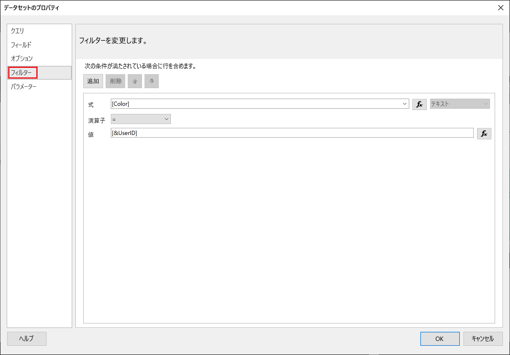
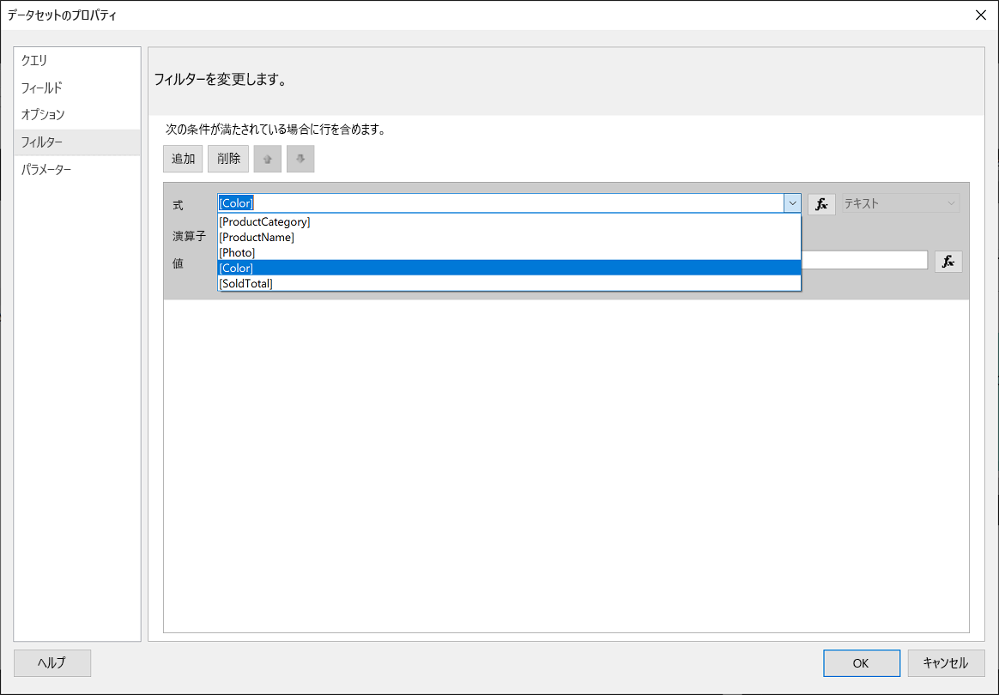
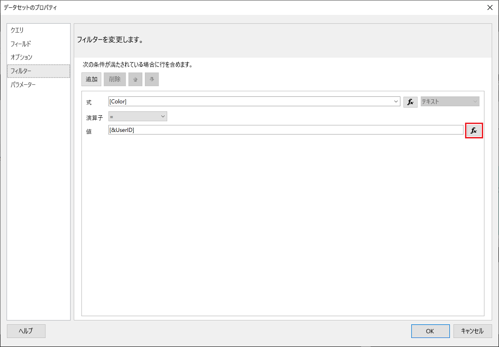
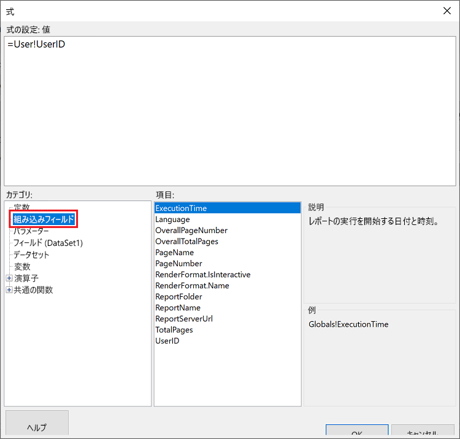
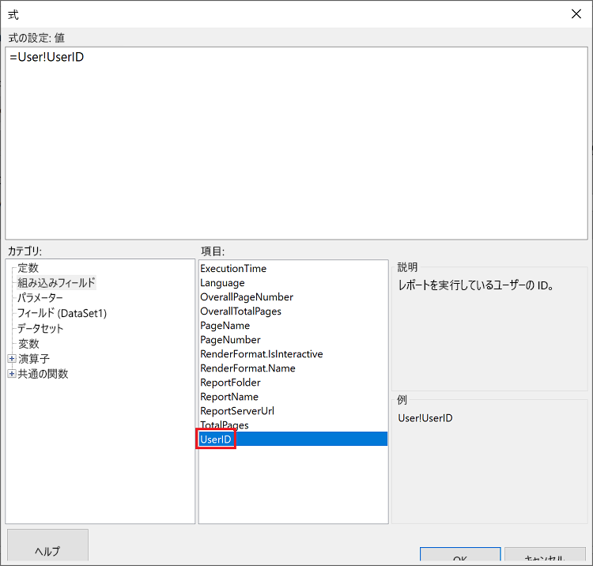
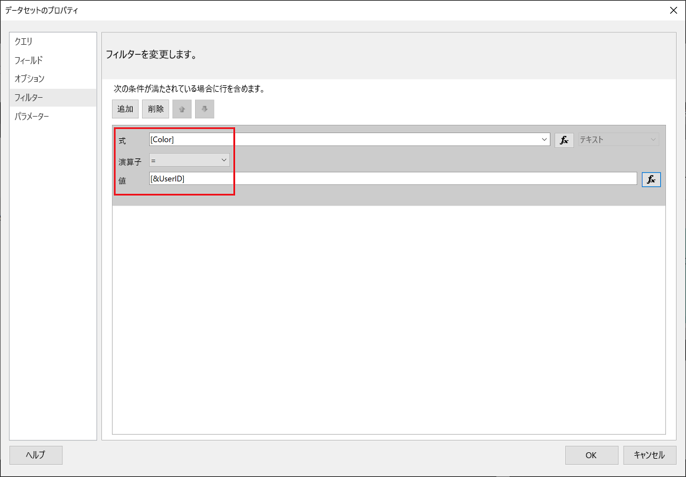
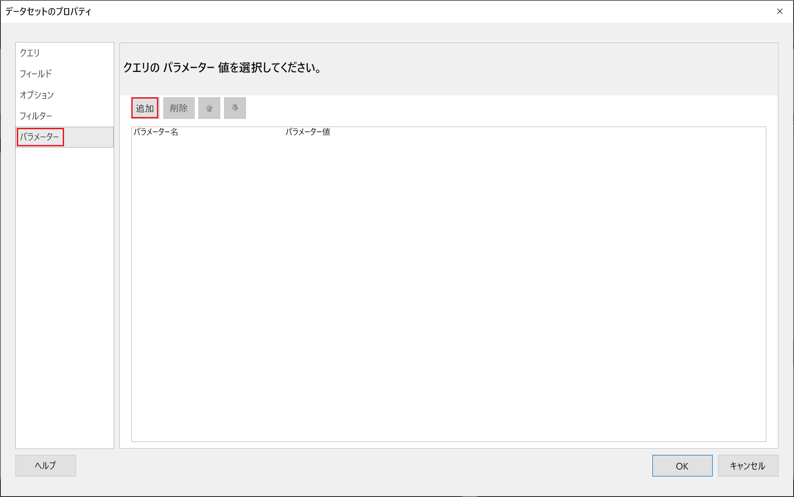
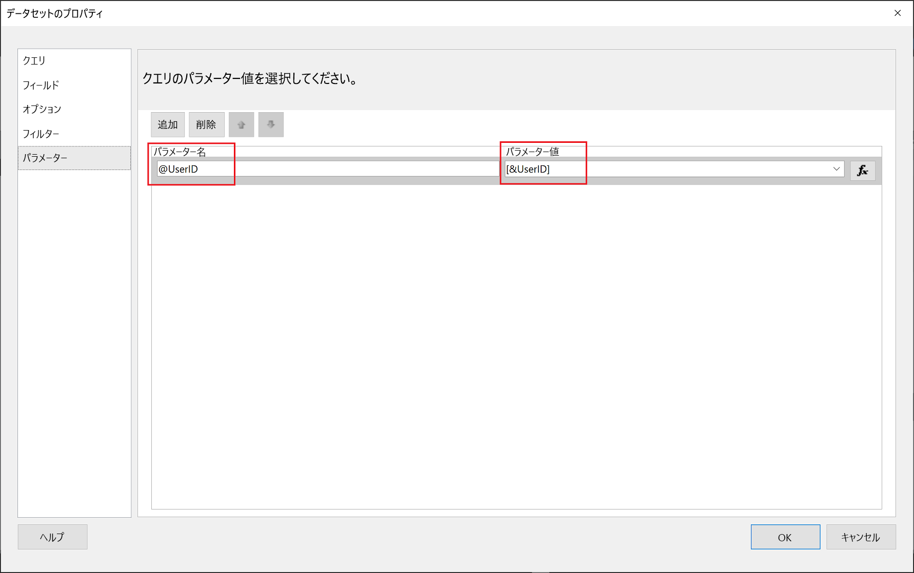
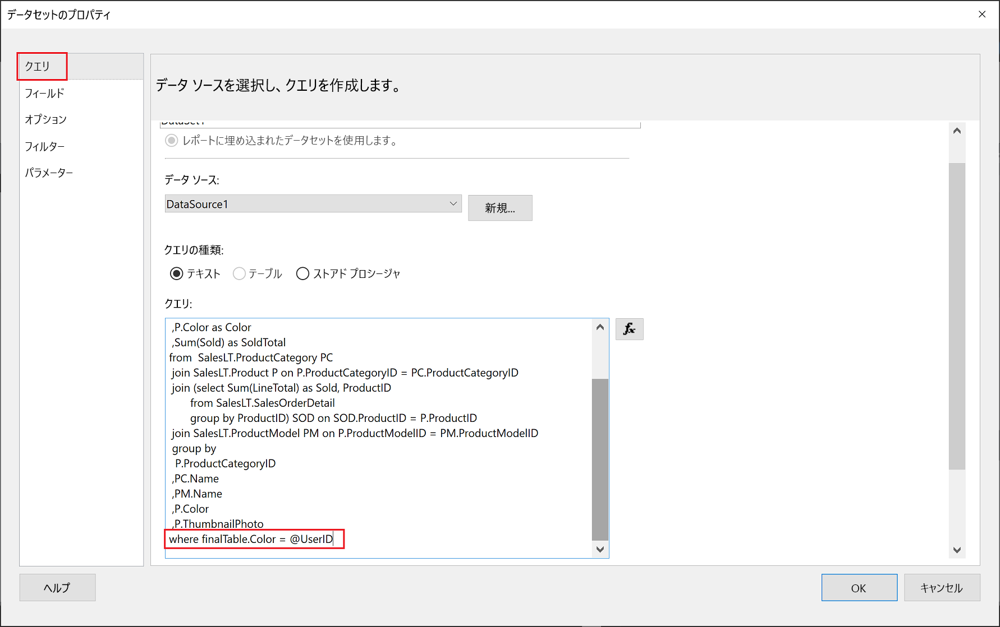

# <a name="implementing-row-level-security-in-embedded-paginated-reports-preview"></a>埋め込みのページ分割されたレポート (プレビュー) での行レベルのセキュリティの実装

ページ分割されたレポートを埋め込むときに、どのデータが表示されるかを制御できます。 これにより、ユーザーごとに表示される情報を調整できます。 たとえば、グローバルな売上結果を含む、Power BI のページ分割されたレポートがある場合は、特定の地域の売上結果のみを使用できるように埋め込むことができます。

この機能を使用すると、データのサブセットを安全に表示することができ、データの残りの部分が侵害されることがありません。 これは、[行レベル セキュリティ (RLS)](embedded-row-level-security.md) 機能に似ています。この機能では、Power BI レポート (ページ分割されていないもの)、ダッシュボード、タイル、およびデータセットで、データを安全に表示することができます。  

> [!Note]
> この機能は、顧客向けにページ分割されたレポートを埋め込む場合に使用します。

## <a name="configuring-a-parameter-to-filter-the-dataset"></a>データセットをフィルター処理するためのパラメーターを構成する

Power BI のページ分割されたレポートに行レベルのセキュリティを適用する場合は、**UserID 属性**に[パラメーター](../report-builder-parameters.md)を割り当てる必要があります。 このパラメーターは、レポートが埋め込まれる前に、データセットからプルされるデータを制限します。

パラメーターを **UserID** に割り当てた後、[Reports GenerateTokenForCreateInGroup](https://docs.microsoft.com/rest/api/power-bi/embedtoken/reports_generatetokenforcreateingroup) API を使用して、埋め込みトークンを取得します。

## <a name="use-userid-as-a-filter-at-report-or-query-level"></a>レポートまたはクエリのレベルで UserID をフィルターとして使用する

**UserId** は、"*フィルター*" として使用することも、[Power BI のページ分割されたレポート ビルダー](../report-builder-power-bi.md)で、データソースに対する "*クエリ*" で使用することもできます。

### <a name="using-the-filter"></a>フィルターの使用

1. **[データセットのプロパティ]** ウィンドウの左側のペインで、 **[フィルター]** を選択します。

    

2. **[式]** ドロップダウン メニューで、データのフィルター処理に使用するパラメーターを選択します。

     

3. **[値]** 関数ボタンをクリックします。 

    

4. **[式]** ウィンドウの **[カテゴリ]** の一覧で、 **[組み込みフィールド]** を選択します。

    

5. **[アイテム]** の一覧で **[UserID]** を選択し、 **[OK]** をクリックします。

    

6. **[データセットのプロパティ]** ウィンドウで、式が " *<選択したパラメーター> = UserID*" であることを確認し、 **[OK]** をクリックします。

    

### <a name="using-a-query"></a>クエリの使用

1. **[データセットのプロパティ]** ウィンドウの左側のペインで **[パラメーター]** を選択し、 **[追加]** をクリックします。

    

2. **[パラメーター名]** に「 **\@UserID**」と入力し、 **[パラメーター値]** に **[&UserID]** を追加します。

     

3. 左側のペインで、 **[クエリ]** を選択し、[クエリ] で **UserID** パラメーターをクエリの一部として追加し、 **[OK]** をクリックします。
    > [!NOTE]
    > 下のスクリーンショットでは、color パラメーターが例として使用されています (whereFinalTable.Color = @UserID)。 必要に応じて、より複雑なクエリを作成することもできます。

    

## <a name="passing-the-configured-parameter-using-the-embed-token"></a>埋め込みトークンを使用して構成済みのパラメーターを渡す

顧客向けのページ分割されたレポートを埋め込むときに、[Reports GenerateTokenForCreateInGroup](https://docs.microsoft.com/rest/api/power-bi/embedtoken/reports_generatetokenforcreateingroup) API を使用して、埋め込みトークンが取得されます。 このトークンを使用して、ページ分割されたレポートからプルされるデータの一部をフィルター処理することもできます。

データの一部のみを公開するには、表示する情報を `username` フィールドに割り当てます。 たとえば、color パラメーターを持つページ分割されたレポートで、`username` フィールドに「*green*」と入力すると、埋め込みトークンによって埋め込みデータが制限され、color 列の値が *green* であるデータのみが表示されます。

```JSON
{
    "accessLevel": "View",
    "reportId": "cfafbeb1-8037-4d0c-896e-a46fb27ff229",
    "identities": [
            {
                    // Replace the 'username' with a paginated report parameter
                    "username":     "...",
                    "reports: [
                        "cfafbeb1-8037-4d0c-896e-a46fb27ff229"
                    ]
            }
    ]
}
```
